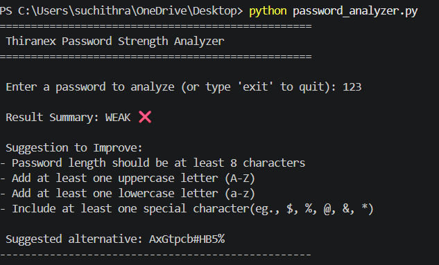
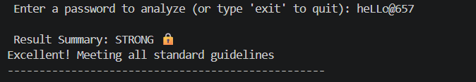

# Thiranex-Password-Strength-Analyzer
This is a Password Strength Analyzer tool developed as part of an internship project. It evaluates the strength of user-entered passwords and provides actionable feedback to improve security.

- **Length Check:** Ensures the password has a sufficient length (minimum 8 characters).
- **Complexity Assessment:** Checks for a combination of uppercase letters, lowercase letters, digits, and special characters.
- **Dynamic Feedback:** Gives clear suggestions on what is missing in the password.
- **Secure Recommendations:** Generates a strong alternative password automatically if the entered password is weak or medium.

**Project outputs**
 **1. Weak Password Analysis (Example)**

 **2. Strong Password Analysis (Example)**

**By using**
- **Language:** Python 3.x
- **Core Modules:** `re` (Regular Expressions), `secrets` (Cryptographically Secure Random Generator), `string`.
